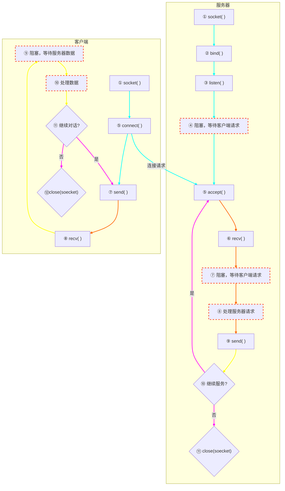
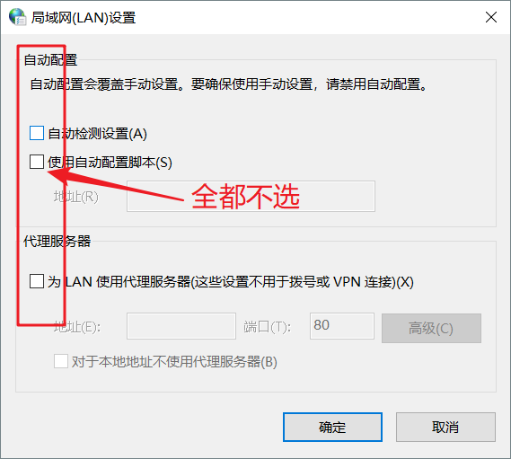

# phpstudy环境+websoket协议==>简易聊天室
<!--[TOC]-->
- [phpstudy环境+websoket协议==>简易聊天室](#)
  - [前言](##前言)

  - [phpstudy环境](##phpstudy环境)

  - [websoket协议](##websoket协议)

    - [服务端处理Socket流程图](###服务端处理Socket流程图)

  - [简易聊天室](##简易聊天室)

  - [会遇到的“怪”](##会遇到的“怪”)

<!--[/TOC]-->
****
## 前言
****
### http连接分为短连接与长连接

#### 短连接用ajax : 简单、耗资源

#### 长连接用websoket : html5、兼容不高

#### 所用工具及版本：phpstudy php7.2.1

## phpstudy环境
****
### 开启extension=php_sockets.dll与extension=php_gd2.dll扩展

## websoket协议
****
### 服务端处理Socket流程图

### 业务逻辑

#### 前期变量

并发人数：`LISTEN_SOCKET_NUM`
日志路径：`LOG_PATH`
socket链接池：`$sockets`
服务端：`$master`

#### 创建套接字

创建套接字：socket_create
设置端口，IP：socket_set_option
绑定端口，IP：socket_bind
监听服务：socket_listen

#### 套接字放入数组

#### 挂起进程遍历套接字数组（重头戏）

死循环阻塞：doServer()
监视socket：socket_select()

#### 进行三次握手（SecWebSocket-Key中获取key写入客户端自动验证）

http升级握手websoket：handShake($socket, $buffer)

#### 解析客户端数据

解帧：parse($buffer)
封帧：build($msg)

#### 将套接字写入缓冲区

## 简易聊天室

## 会遇到的“怪”

var ws = new WebSocket("ws://127.0.0.1:8080");

连接成功：ws.onopen = function () 
分析信息：
*msg.type : 消息类型*

user 普通信息;
system 系统信息;
handshake 握手信息;
login 登陆信息; 
logout 退出信息;

*msg.from : 消息来源*

*msg.content: 消息内容*
连接失败：ws.onerror = function () 
聊天框
用户登录信息

### 1、服务未开启

> VM56:1 WebSocket connection to 'ws://127.0.0.1:8080/' failed: Error in connection establishment: net::ERR_CONNECTION_REFUSED

****

*可能导致net::ERR_CONNECTION_REFUSED的原因*
> 一、服务器  
> 1. 未开启服务器  
  1-1 sever.php没有运行  
  1-2 sever.php报错  
  1-3 sever.php直接结束跳出  
> 2. 自建服务器：防火墙没有放行对应的IP或端口
> 3. 云服务器：  
  3-1 云服务器自带的内层防火墙没有放行对应的端口  
  3-2 安全组其实也是一种外层防火墙，默认同样也可能会阻止连接，所以需要到管理后台手动放行对应端口 
 
> 二、客户端  
> 1. 使用域名连接：域名可能指向了错误的服务器IP  
> 2. 客户端访问的IP是服务器内网IP，并且客户端和服务端不在同一个内网;
> 3. 客户端和服务端中间可能使用了代理，那么确保代理配置OK  
> 4. 使用域名连接：域名可能指向了错误的服务器IP  
> 5. 如果客户端是浏览器，尝试清理下浏览器的所有缓存数据
> 6. 如果客户端是浏览器，尝试调整下Internet局域网设置  
  6-1 操作步骤：控制面板->网络与Interent->Interent选项->连接->局域网设置->取消自动配置与代理服务器  
  6.2 参考图：

****
**解决方案**  

1、查看server.php  

2、客户端监听ip使用 `0.0.0.0`

****

### 2、phpstudy环境未开启webSocket扩展

>PHP Fatal error:  Uncaught Error: Call to undefined function socket_create() 

**解决方案**

1、打开phpstudy->其他选项菜单->打开配置文件->php.ini

2、找到extension=php_sockets.dll与extension=php_gd2.dll

3、去掉前面的 `;` 号,启动扩展并重启phpstudy

### 3、linux函数与window函数不一致

>PHP Fatal error:  Uncaught Error: Call to undefined function get_current_user() 

**解决方案**

window使用：`get_current_user()`

linux使用：`posix_getpid()`